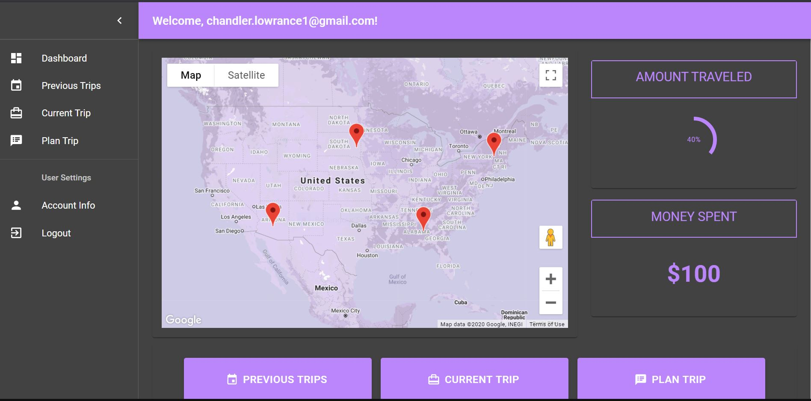
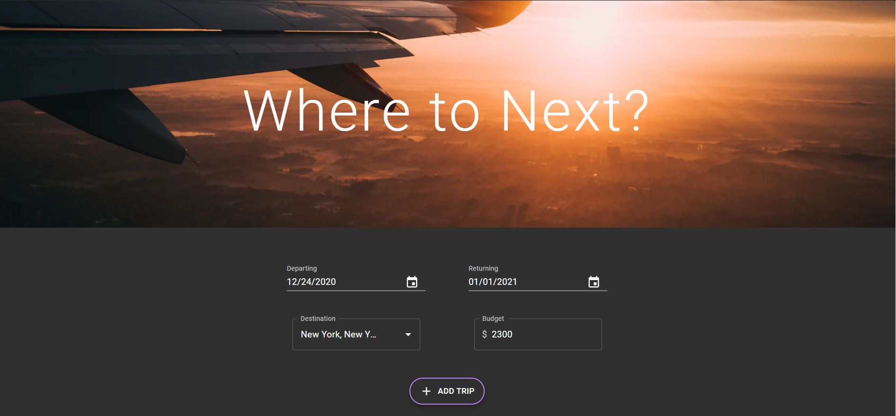

# Stateside


Welcome to Stateside! We are a unique travel application that allowers users to do more than just plan a trip, instead offering users the ability to not only plan trips, but add information about that trip to the app while on the trip, and then, upon completion of their trip, users may view a memory of their experience. On top of these three main features, users will also find a map feature that saves the locations the user has visited on a map for easy access. In terms of technologies used, one can find modern React.js making use of multiple components to create an easy to interact with UI and UX. Other technologies used include; AWS (Amplify / Cognito), Node.js, HTML, CSS, JSX, jQuery, MongoDB (Database), and others. To view the deployed application, please click on the following link: 

## Features

A few of the things you can do with Stateside:

* Easily plan a trip to anywhere within the contintntal United States.
* View a concise and simplistic "Current Trip" page allowing you to track your budget and actvities from a given trip.
* Quickly access your previous trips at any point to view what you did during that trip, view photos from that trip, and reminise upon your experience.

## User Story

```
AS AN individual who travels the United States often for business or pleasure
I WANT to be able to effevtively plan and execute trips that I can also look back on
SO THAT I can keep an efficient log of where I have been and what I have done
```

## Table of Contents


* [Installation](#installation)
* [License](#license)
* [Questions](#questions)
* [Contributors](#contributors)
* [Media](#media)

# Installation

To run this application locally, in the event the deployed page fails, please do the following;

Following downloading the repository, enter into your terminal:
- npm install
- npm run start

# License

Application working under an MIT license

# Questions

Reach out to me via email regarding any questions or concerns with this project:
- chandler.lowrance1@gmail.com


# Contributors

| Barrett
------------ 

[<br /><sub><b>Barrett Pope</b></sub>](https://github.com/Barrettpope)<br />[💻](https://github.com/Barrettpope?tab=repositories "Repositories")

| Chandler
------------ 

[<br /><sub><b>Chandler Lowrance</b></sub>](https://github.com/Chandler8)<br />[💻](https://github.com/Chandler8?tab=repositories "Repositories")

| Natalie
------------ 

[<br /><sub><b>Natalie Garcia</b></sub>](https://github.com/nataliegarcia-8)<br />[💻](https://github.com/nataliegarcia-8?tab=repositories "Repositories")

| Santiago
------------ 

[<br /><sub><b>Santiago Solana</b></sub>](https://github.com/santu14)<br />[💻](https://github.com/santu14?tab=repositories "Repositories")

# Media


